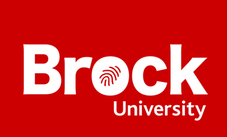
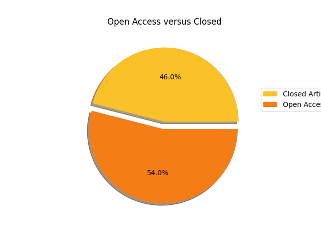
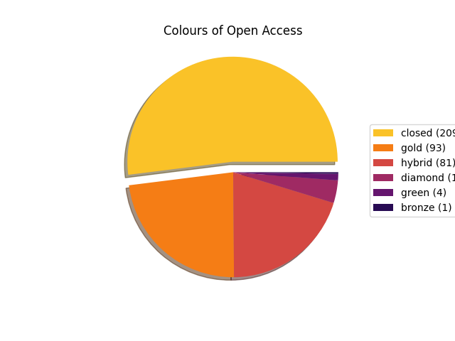
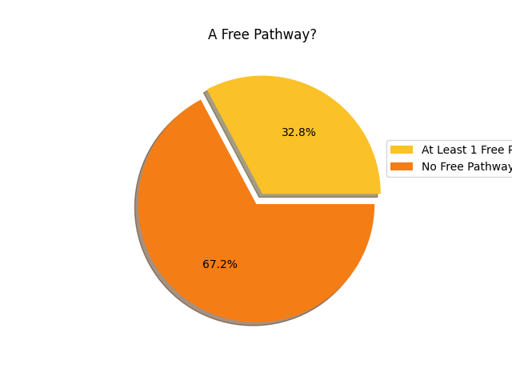
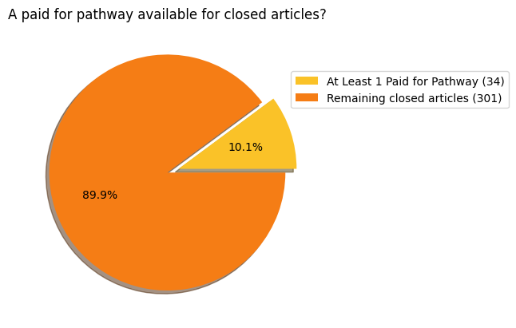
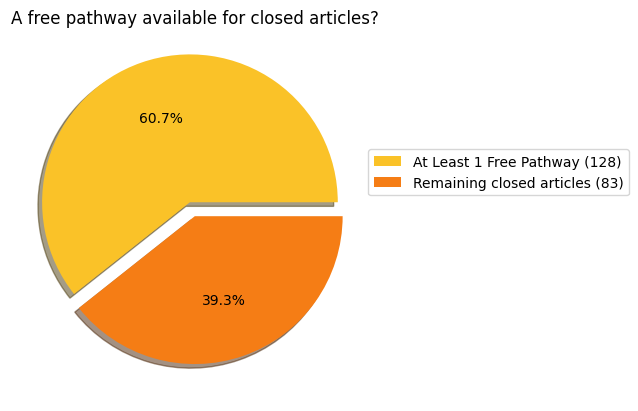
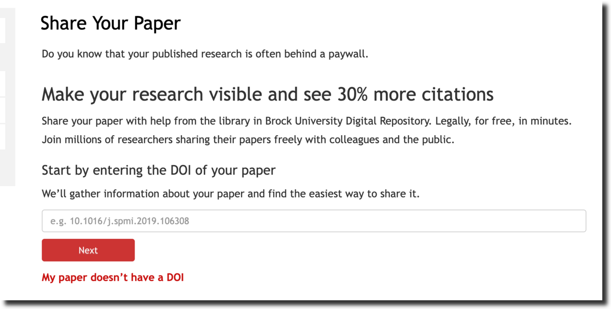
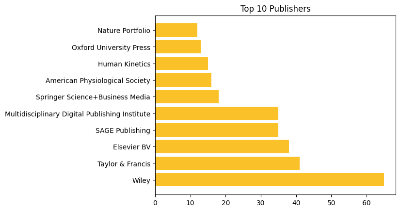
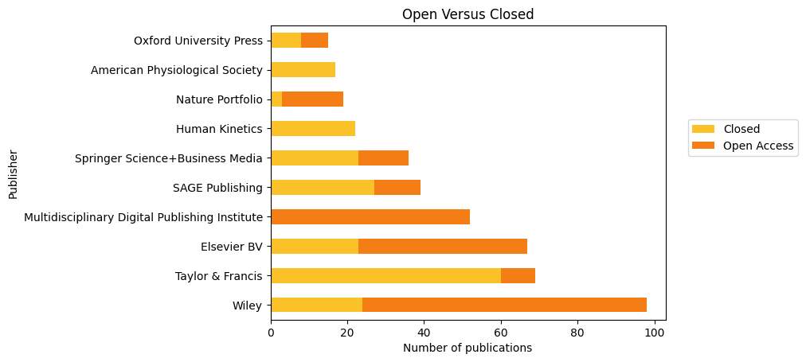

 
# 2025 State of Scholarly Publishing Report

## Prepared by Brock Library Research Lifecycle Department

## What is this?
A yearly check-in of some Scholarly Publishing topics at Brock University. It presents some analysis of publishing trends at Brock University over the 2024/2025 academic year. This inaugural report is being released in conjunction with [Open Access Week 2025](https://www.openaccessweek.org/theme) to highlight Brock's participation in Open Access journal publishing.

## Journal articles published

Over the course of July 1, 2024 to June 30, 2025 a total of: **670** articles have been published by Brock Researchers.

### Open Access versus Closed

We can divide all journal articles into two categories: _Open Access_ or _Closed_. The Brock Library [website](https://brocku.ca/library/open-access/) explains the dynamics of these differences. The most important detail here however is that Open Access articles are available to readers **without any payment**! Sometimes a journal charges an author processing charge **(APC)** to  make an article open access. This happens for both closed journals with some Open Access content and for totally Open Access journals. 

Sometimes it is possible to **publish an earlier version** of a closed journal article in a place like the [Brock University Digital Repository](https://brocku.scholaris.ca/home) to have it become Open Access. We call this having a Green Open Access Pathway.

Does this sound confusing? Well it is. The following graph show the proportion of closed and open access articles published by Brock researchers.

#### Colours of Open Access

We can now examine the the **different colours** of Open Access journals published. The pie graph below shows the breakdown of these categories versus the closed articles published. The library website has a description of what these colours mean.

#### Green Open Access

<!-- When publishing in a closed journal there is often something called a _green pathway_ that will allow the author to either buy out Open Access rights to the article or to allow them to deposit a certain version of their article to the Brock University Digital Repository. The breakdown of what Green pathways exist for Brock author is shown in the following pie graphs.

 -->

#### Paid for Pathways for Closed Articles

As described above we can sometimes achieve Green Open Access by posting a version of an article or by paying a fee. The following graph shows how many of the still Closed papers have at least one paid for pathway to achieve some version of Open Access. What this means in practice is that the author(s) of the paper can pay a supplimenatary APC after publication to move the paper from Closed to Open Access. This can get expensive however. (APCs data is analyzed littler later on in this report).

#### A Free Pathway for Closed Articles

In contrast, the following graph shows how many Closed papers have at least one _free pathway_ to achieve some version of Open Access. This is great news, by doing a bit of work we can make a bunch of research available Open Access without paying any money.

This means that there is a **free** way to make **188** closed articles Open Access!

#### Outreach for Open Access!

The library is developing a program to contact Brock affliated authors of these **188** articles to encourage them to submit an eligible version into the Brock Digital Repository to achieve Open Access. All researchers will need to is copy and paste the DOI of their paper and upload a PDF copy to a [form](https://researchguides.library.brocku.ca/getting-your-research-out/depositing-open-access).

If you published recently and fall in this category of **Closed**, expect an email soon with more details about this project.

## APCs

As described some publishers enable Open Access through the payment of an additional Author Processing Charge (APC). This is on top of regular subscription costs that the library already pays to get access to the journal. All figures in CAD. Sometimes this fee is paid by a research grant, sometimes directly by the researcher. Since research teams span different organizations APC payments might also span different organizations, so it is fair to say these fees weren't all paid out by Brock researchers directly.

- Total amount spent: **$1,027,839**
- Mean Average amount per paid APC: **$4,111**
- About **56%** of the published items had an APC attached to them
- About **56%** of items that had an APC, had that APC paid for

The Brock Library now has a collection of _Transformative Agreement_s with some publishers that will offer some [discounts](https://brocku.ca/library/open-access/open-access-investments/#1675264614266-ad3c5d97-5fef) to APC charges.

## Popular Titles and Popular Publishers

Some journal titles are popular with Brock Authors.

Some publishers also rank high in popularity.

Are these popular publishers producing open access content? We can combine a few things now to see just how open our top publishers are.

## How do I get my research out

We have developed a new [guide](https://researchguides.library.brocku.ca/getting-your-research-out) that will help you get the most of out of your publishing. The first step is to create an ORCID, and put Brock in your affiliation, both of these steps are outlined in the guide. Then when you publish be sure to share your ORCID with the journal and your content will automatically get included in this analysis.

Please don't hestitate to get in [touch](https://brocku.ca/library/tim-ribaric/) with us if you have questions about how this works, or if you need help setting up the pieces.

## Reproducibility

This data is built with a few assumptions involved and outlined below

- Journal content with a _DOI_ available to _OpenAlex_
- Brock researchers with a _Brock ROR_ in their ORCID record.

Notebooks and data used to compile this report are freely available [online](https://github.com/elibtronic/2025_state_of_scholarly_communication). If you have an idea for what to add to this report please get in touch.

## Acknowledgements & Further Information

The data in this analysis was sourced from

[OpenAlex](https://openalex.org/)

[Open Policy Finder](https://openpolicyfinder.jisc.ac.uk/)

- Special Thanks to Erin Moorhead, Research Lifecycle Intern
- Consult our [Getting Your Research Out](https://researchguides.library.brocku.ca/getting-your-research-out) Guide for more information
- Please contact [Tim Ribaric](https://brocku.ca/library/tim-ribaric/) Scholarly Publishing and Platforms Librarian
