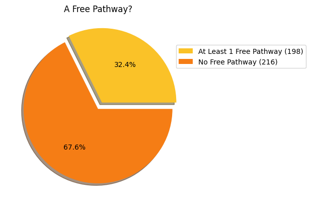

# 2025 Report

# Current to Sept 11 Only!

## What is this?
A yearly check-in of some Scholarly Publishing topics at Brock University. It presents some snapshots and analysis of publishing trends at Brock University. 

This inaugural report is being released during [Open Access Week 2025](https://www.openaccessweek.org/theme). Future reports will be released in January summarizing the previous year. 

## Journal articles published

Over the course of January 1, 2025 to October 1, 2025 a total of: **402** articles have been published by Brock Researchers.

### Open Access versus Closed

The Brock Library [website](https://brocku.ca/library/open-access/) explains the dynamics of Open Access is detail.

#### Colours of Open Access

The different colours of Open Access represent the different classes of Open Access. The pie graph below shows the breakdown of these categories of the Brock published journal articles.

[PIE, Green, Gold, etc]

#### Green Open Access pathways?

When publishing in a closed journal there is often something called a _green pathway_ that will allow the author to either buy out Open Access rights to the article or to allow them to deposit a certain version of their article to the Brock University Digital Repository. The breakdown of what Green pathways exist for Brock author is shown in the following pie graphs.

#### Outreach to achieve Green!

The library is developing a program of contacting Brock affliated authors of Green eligible journal articles to encourage them to submit an eligible version into the Brock Digital Repository. All researchers will need to is copy and paste the DOI of their paper and upload a PDF copy to a [form]().

Expect an email soon with more details about this.

## APCs

Some publishers enable Open Access through the payment of an additional Author Processing Charge (APC). This is on top of regular subscription costs. All figures in CAD

- Total amount spent: **$621,484**
- Average amount per paid APC: **$3959**
- About **55%** of the published items had an APC attached about
- About **54%** of items that had an APC, had that APC paid for

The Brock Library now has a collection of Transformative Agreements with some publishers that will offer some [discounts](https://brocku.ca/library/open-access/open-access-investments/#1675264614266-ad3c5d97-5fef) to APC charges.

## Popular Titles and Popular Publishers

Some journal titles are popular with Brock Authors.

## Reproducibility

This data is built with a few assumptions involved and outlined below

- Journal content with a _DOI_ available to _OpenAlex_
- Brock researchers with a _Brock ROR_ in their [ORCID](https://orcid.org/) record

The notebooks and dataset used:

- [Data Set](Brock_OpenAlex_Harvest_Start_Date_2025-01-01_to_2025-09-01.csv)
- [Data Set Creation and OA Analysis](2025_SofSC.ipynb)
- [APC Analysis](2025_APC_Analysis.ipynb)

If you have an idea for what to add to this report please get in touch.

## Acknowledgements

The data in this analysis was sourced from

[OpenAlex](https://openalex.org/)

[Open Policy Finder](https://openpolicyfinder.jisc.ac.uk/)

Special Thanks to Erin Moorhead, Research Lifecycle Intern

## Further Information

- Consult our [Getting Your Research Out]() Guide for more information
- Please contact [Tim Ribaric](https://brocku.ca/library/tim-ribaric/) Scholarly Publishing and Platforms Librarian
